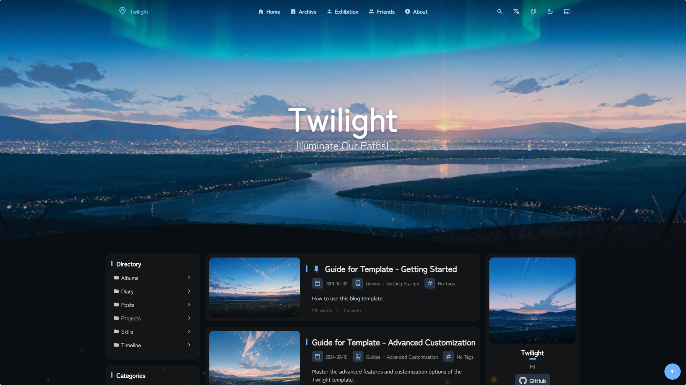

<div align = "center">

# Twilight

A CMS integrated static blog template built with Astro framework.

[**🖥️ Live Demo**](https://twilight.spr-aachen.com)
[**📝 Documentation**](https://docs.twilight.spr-aachen.com/en)

[](https://space.bilibili.com/359461611/lists/6641229)&nbsp;
[](https://youtube.com/playlist?list=PLzjq8Hx1SRV7yqZQiACcCJmKPeg5D8JKe&si=Bcz2o0PF8MFvx8ec)

<table style="width: 100%; table-layout: fixed;">
   <tr>
      <td colspan="5"></td>
   </tr>
   <tr>
      <td></td>
      <td></td>
      <td></td>
      <td></td>
      <td></td>
   </tr>
</table>

</div>

---

<div align = "center">

English | [**中文**](docs/README_ZH.md)

</div>


## ✨ Features

### Content Management
- **CMS Integration**: Headless CMS with OAuth for easy content management
- **Pinned & Draft Posts**: Pin important posts or hide drafts in production
- **Password-Protected Posts**: AES-encrypted articles with password access
- **Automatic Navigation**: Auto-generated post navigation, archive, and TOC
- **Data Visualization**: Visualized personal data like projects, skills, timeline

### Content Pages
- **Blog Posts**: Full-featured markdown blogging with tags and categories
- **Projects & Skills Showcase**: Visual galleries for your portfolio
- **Timeline**: Biography page with education, work, achievements, and skills
- **Diary**: Short-form microblog-style posts with timestamps
- **Albums**: Image gallery with Fancybox lightbox integration
- **Friends Links**: Friend link exchange with icons and descriptions
- **RSS & Atom Feeds**: Dedicated info pages with auto-generated XML feeds

### Markdown Enhancements
- **GitHub Repository Cards**: Embed live repo cards via `::github{repo="..."}`
- **Music Cards**: Inline audio player with lyrics via `::music{...}`
- **Admonitions / Callouts**: Note, tip, warning, and caution styled blocks
- **Code Block Enhancements**: Copy button, collapse, line numbers, language badges
- **Mermaid Diagrams**: Render ` ```mermaid ` code blocks as diagrams
- **KaTeX Math Rendering**: LaTeX math expressions with `$...$` and `$$...$$`

### UI Components
- **Loading Overlay**: Configurable splash screen with spinner animation
- **Sidebar Widget System**: Configurable profile, announcement, TOC, categories, tags, directory, statistics etc.
- **Analytics Support**: Umami analytics integration for visitor insights
- **Comment System**: Twikoo-powered comment functionality
- **Music Player**: Background music with meting API or local playlist support
- **PIO Widget**: Interactive Live2D character with customizable dialog

### Visual Effects
- **Smooth Transition Animations**: Polished page component transition animations
- **Customizable Theme Colors**: Real-time customizable color schemes
- **Dynamic Wallpaper System**: Carousel support with multiple display modes
- **Immersive Particle Effects**: Highly customizable animated particles
- **Custom Fonts**: Configurable web fonts via CSS links or local files

### Compatibility
- **Modern & Responsive Design**: Fully optimized for desktop and mobile devices
- **Multilingual Capability**: 3 UI languages (en/zh/ja) & 12+ page translation languages
- **Multiple Deployment Adapters**: Support Cloudflare, Netlify, Vercel, EdgeOne and other static hosting platforms
- **Docker Support**: Ready-to-use Docker and docker-compose setup


## 💻 Configuration

1. **Clone the repository:**
   ```bash
   git clone https://github.com/Spr-Aachen/Twilight.git
   # Navigate to the project directory
   cd Twilight
   ```

2. **Install dependencies:**
   ```bash
   # Install pnpm if not already installed
   npm install -g pnpm
   # Install project dependencies
   pnpm install
   ```

3. **Configure your blog:**
   - [Customize blog settings](https://docs.twilight.spr-aachen.com/en/config/core) inside `twilight.config.yaml`
   - [Manage site content](https://docs.twilight.spr-aachen.com/en/config/content) inside `src/content`

4. **Start the development server:**
   ```bash
   pnpm dev
   ```


## 🚀 Deployment

Deploy your blog to any static hosting platform


## ⚡ Commands

| Command                     | Action                        |
|:----------------------------|:------------------------------|
| ~~`pnpm lint`~~             | ~~Check and fix code issues~~ |
| ~~`pnpm format`~~           | ~~Format code with Biome~~    |
| `pnpm check`                | Run Astro error checking      |
| `pnpm dev`                  | Start local dev server        |
| `pnpm build`                | Build site to `./dist/`       |
| `pnpm preview`              | Preview build locally         |
| `pnpm astro ...`            | Run Astro CLI commands        |
| `pnpm new-post <filename>`  | Create a new blog post        |


## 🙏 Acknowledgements

- Prototype   - [Fuwari](https://github.com/saicaca/fuwari)
- Inspiration - [Yukina](https://github.com/WhitePaper233/yukina) & [Mizuki](https://github.com/matsuzaka-yuki/Mizuki)
- Translation - [translate](https://gitee.com/mail_osc/translate)